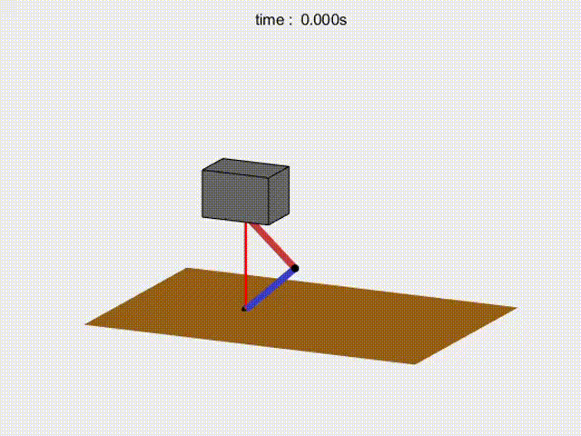

# MX_TO_Hopper

A [towr](https://github.com/ethz-adrl/towr)-inspired **continuous jumping** motion optimization for a one-legged robot.

With the **direct collocation** and the NLP solver **fmincon** of matlab, the trajectory optimizer can automatically optimize

- **position of the footholds**
- **total motion duration**
- **swing trajectories of the foot**
- **contact forces**
- **motion trajectory of the floating-base**

by using the **hybrid single rigid body model (SRBM) dynamics** and the **phase-based end-effector constraints**.
